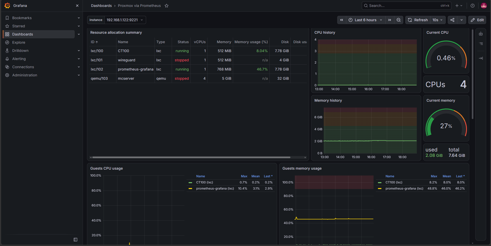

# Personal Homelab Infrastructure

A personal self-hosted homelab built to gain practical experience with virtualization, Linux administration, networking, DNS, remote access, monitoring, and server management.

The infrastructure is built on **Proxmox VE** running on a small dedicated computer.

---

## Overview

This project documents the design, configuration, troubleshooting, monitoring, and future improvements of my personal homelab.

The main goal is to build and manage real infrastructure rather than relying entirely on simulated environments.

### Main Technologies

* Proxmox VE
* LXC Containers
* QEMU Virtual Machines
* Debian Linux
* Xubuntu
* Pi-hole
* Tailscale
* Prometheus
* Grafana
* Prometheus PVE Exporter
* Prometheus Node Exporter
* Blackbox Exporter
* SSH
* DNS
* IPv4 Networking
* Linux System Administration
* Network Troubleshooting

---

## Architecture

```text
                              Internet
                                 │
                                 │
                          Home Router
                           192.168.1.1
                                 │
                              Ethernet
                                 │
                       ┌──────────────────┐
                       │   Proxmox Host   │
                       │     darwish      │
                       │   192.168.1.120  │
                       └────────┬─────────┘
                                │
                              vmbr0
                                │
             ┌──────────────────┼──────────────────┐
             │                  │                  │
             ▼                  ▼                  ▼
        LXC CT100          LXC CT102           VM103
         Pi-hole       Prometheus + Grafana   Minecraft
     192.168.1.121       192.168.1.122       192.168.1.159
             │                  │                  │
             │                  │                  │
       DNS Filtering       Monitoring         Game Server
                            Stack
                                │
                    ┌───────────┼───────────┐
                    │           │           │
                    ▼           ▼           ▼
               Prometheus   Exporters   Blackbox
                    │                    Exporter
                    ▼
                 Grafana
                    │
                    ▼
              Dashboards
              & Alerts

                    Tailscale
                       │
                       ▼
                     Phone
                Remote Access
```

---

## Infrastructure

| Component    | Purpose                    | Technology                    |
| ------------ | -------------------------- | ----------------------------- |
| Proxmox Host | Virtualization platform    | Proxmox VE                    |
| CT100        | Network-wide DNS filtering | Pi-hole                       |
| CT102        | Infrastructure monitoring  | Debian + Prometheus + Grafana |
| VM103        | Minecraft server           | Xubuntu + Java                |
| Tailscale    | Secure remote access       | VPN / subnet routing          |

---

## Proxmox

The Proxmox server acts as the central virtualization platform for the homelab.

It provides:

* Virtual machine management
* LXC container management
* Virtual networking
* Resource allocation
* Storage management
* Centralized infrastructure administration

The Proxmox host uses the `vmbr0` network bridge to provide network connectivity to the containers and virtual machines.

More information:

[Proxmox Documentation](documentation/proxmox.md)

---

## Pi-hole

Pi-hole runs inside an LXC container and provides network-wide DNS filtering.

### Functions

* DNS-based advertisement blocking
* Tracker blocking
* DNS query monitoring
* Network-wide filtering
* DNS troubleshooting

The Pi-hole container is connected directly to the Proxmox network bridge.

More information:

[Pi-hole Documentation](documentation/pihole.md)

---

## Minecraft Server

A dedicated Xubuntu virtual machine hosts a vanilla Minecraft Java Edition server.

The server is isolated from the Proxmox host and other infrastructure services.

### Configuration

* Minecraft Java Edition 1.21.8
* Xubuntu
* Java
* 4 CPU cores
* 5 GB RAM
* 32 GB virtual disk
* TCP port `25565`

The Minecraft server is also monitored using Blackbox Exporter to detect whether the server's TCP port is reachable.

More information:

[Minecraft Server Documentation](documentation/minecraft.md)

---

## Monitoring

A dedicated monitoring stack runs inside CT102.

### Monitoring Stack

* **Prometheus** — collects and stores metrics
* **Grafana** — visualizes infrastructure metrics
* **Prometheus PVE Exporter** — collects Proxmox metrics
* **Node Exporter** — collects Linux system metrics
* **Blackbox Exporter** — performs service availability probes

The monitoring system tracks infrastructure and service availability including:

* Proxmox
* Pi-hole DNS
* CT102 system resources
* Minecraft server availability

Prometheus alert rules are also configured to detect service failures and resource usage problems.

### Grafana Dashboard



More information:

[Monitoring Documentation](documentation/monitoring.md)

---

## Remote Management

Tailscale is installed on the Proxmox host for secure remote management.

The Proxmox host also acts as a Tailscale subnet router, allowing remote devices connected to Tailscale to access services on the home network.

Example:

```text
Phone
  │
  │ Mobile Data / Internet
  │
  ▼
Tailscale
  │
  ▼
Proxmox Host
  │
  │ Subnet Routing
  ▼
Home Network
  │
  ├── Proxmox
  ├── Pi-hole
  └── Grafana
```

This allows remote access without directly exposing the Proxmox management interface or Grafana to the public internet.

A Tailscale DNS name is also configured for Grafana:

```text
grafana.home
```

More information:

[Tailscale Documentation](documentation/tailscale.md)

---

## Troubleshooting

One of the main purposes of this project is to document real problems encountered while building and operating the infrastructure.

### Examples

* Proxmox network configuration issues
* DNS resolution problems
* Pi-hole filtering issues
* Minecraft server connectivity
* Port forwarding
* Virtual machine networking
* Prometheus exporter configuration
* Monitoring and alerting
* Remote management

### Troubleshooting Guides

* [Proxmox Networking](troubleshooting/proxmox-networking.md)
* [Pi-hole DNS](troubleshooting/pihole-dns.md)
* [Minecraft Server](troubleshooting/minecraft-server.md)

---

## Skills Demonstrated

This project provides practical experience with:

### Virtualization

* Proxmox VE
* LXC containers
* QEMU virtual machines
* Virtual networking
* Resource allocation

### Linux

* Debian
* Xubuntu
* SSH
* Linux networking
* Service management
* Command-line administration

### Networking

* IPv4 addressing
* Subnets
* Default gateways
* DNS
* DHCP
* Network bridges
* Port forwarding
* VPN-based remote access
* Tailscale subnet routing

### Monitoring

* Prometheus
* Grafana
* PromQL
* Node Exporter
* Blackbox Exporter
* Proxmox monitoring
* Service availability monitoring
* Alert rules

### Infrastructure

* Server deployment
* Service isolation
* Infrastructure monitoring
* Network troubleshooting
* Remote administration
* Technical documentation

---

## Lessons Learned

Building this homelab has provided hands-on experience with problems that are difficult to understand from theory alone.

Some of the most important lessons include:

* Understanding how virtual machines and containers connect to a physical network
* Configuring Linux networking
* Troubleshooting DNS resolution
* Managing services remotely
* Monitoring infrastructure and service availability
* Configuring exporters and monitoring targets
* Creating and testing infrastructure alerts
* Separating infrastructure services from application workloads
* Diagnosing connectivity problems
* Understanding the relationship between routers, DNS, virtual networks, and servers

One important lesson from the monitoring setup was that monitoring the monitoring system itself is different from monitoring the service being tested.

For example, Blackbox Exporter can be running normally while the service it is probing is unavailable. The actual probe result must therefore be checked using metrics such as `probe_success`.

---

## Future Improvements

Possible future improvements include:

* Automated Proxmox backups
* Dedicated backup storage
* Network segmentation
* Improved security controls
* Infrastructure automation
* Additional service monitoring
* External alert notifications
* Network traffic monitoring
* Temperature monitoring
* Additional self-hosted services
* Better infrastructure diagrams

---

## Repository Structure

```text
personal-homelab/
│
├── README.md
│
├── documentation/
│   ├── proxmox.md
│   ├── pihole.md
│   ├── tailscale.md
│   ├── minecraft.md
│   └── monitoring.md
│
├── troubleshooting/
│   ├── proxmox-networking.md
│   ├── pihole-dns.md
│   └── minecraft-server.md
│
├── docs/
│   └── images/
│       ├── grafana-dashboard.png
│       ├── prometheus-targets.png
│       └── prometheus-alerts.png
│
└── diagrams/
```

---

## Project Goals

The long-term goal of this project is to develop a practical understanding of infrastructure and systems administration by continuously building, maintaining, troubleshooting, monitoring, and improving a real self-hosted environment.

This homelab also serves as a portfolio project demonstrating practical experience beyond academic coursework.
