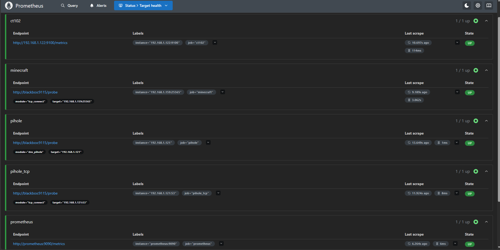
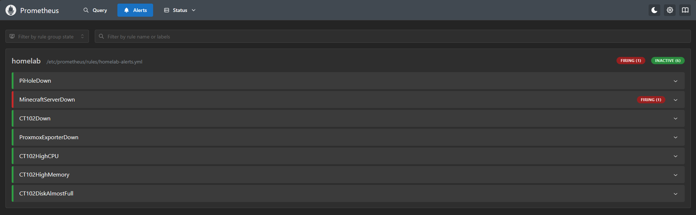

# Homelab Monitoring

## Overview

A monitoring stack was added to the homelab to monitor the health and availability of the Proxmox host, containers, and services.

The monitoring system uses:

* Prometheus
* Grafana
* Prometheus PVE Exporter
* Prometheus Node Exporter
* Blackbox Exporter

Prometheus collects and stores monitoring data, while Grafana provides dashboards and visualization.

The monitoring system runs inside CT102, named `prometheus-grafana`.

---

## Why Monitoring?

As the number of services in a homelab increases, it becomes harder to manually check whether everything is working.

For example, a service may stop responding without being immediately obvious.

The monitoring system provides a central place to observe:

* CPU usage
* Memory usage
* Disk usage
* System availability
* Proxmox status
* Container health
* DNS availability
* Network service availability
* Minecraft server availability

It also provides alerts when selected conditions remain unhealthy for a defined period.

---

## Monitoring Architecture

```text
                         Proxmox Host
                         192.168.1.120
                               │
              ┌────────────────┼────────────────┐
              │                │                │
              ▼                ▼                ▼
          Pi-hole           CT102           Minecraft
        192.168.1.121    192.168.1.122    192.168.1.159
              │                │                │
              │                │                │
              │          Node Exporter      Blackbox
              │             :9100          Exporter
              │                │                │
              └────────────────┼────────────────┘
                               │
                         Prometheus
                           :9090
                               │
                               ▼
                            Grafana
                             :3000
                               │
                               ▼
                         Dashboards
                         & Alerts
```

---

## Monitoring Components

### Prometheus

Prometheus is responsible for collecting and storing monitoring data.

It periodically scrapes configured targets and stores the resulting metrics.

The default scrape interval for this homelab is:

```text
15 seconds
```

Prometheus is available on:

```text
192.168.1.122:9090
```

---

### Grafana

Grafana is used to visualize the metrics collected by Prometheus.

It provides dashboards for viewing:

* CPU usage
* Memory usage
* Disk usage
* Network activity
* System status
* Service availability

Grafana is available on:

```text
192.168.1.122:3000
```

A Tailscale DNS name is also configured for remote access:

```text
grafana.home
```

---

### Prometheus PVE Exporter

The Prometheus PVE Exporter allows Prometheus to collect metrics from Proxmox VE.

The architecture is:

```text
Proxmox
   │
   ▼
PVE Exporter
   │
   ▼
Prometheus
   │
   ▼
Grafana
```

The exporter runs on CT102 and listens on:

```text
9221
```

A dedicated Proxmox monitoring account and API token are used for monitoring.

The monitoring account is assigned the `PVEAuditor` role.

Authentication credentials and token values are intentionally excluded from this repository.

---

### Node Exporter

Node Exporter provides Linux system metrics.

It is installed directly on CT102.

Node Exporter listens on:

```text
9100
```

Prometheus collects metrics from:

```text
192.168.1.122:9100
```

This allows Grafana to display information such as:

* CPU utilization
* Memory utilization
* Filesystem usage
* Network statistics
* System uptime

---

### Blackbox Exporter

Blackbox Exporter is used to test whether services are actually reachable.

Instead of collecting internal application metrics, Blackbox Exporter performs probes from the monitoring system.

The homelab uses:

* DNS probes
* TCP connection probes

Blackbox Exporter listens on:

```text
9115
```

---

## Service Monitoring

### Pi-hole

Pi-hole is monitored using two probes.

#### DNS Probe

Prometheus asks Blackbox Exporter to perform a DNS query through Pi-hole.

```text
Prometheus
    │
    ▼
Blackbox Exporter
    │
    │ DNS query
    ▼
Pi-hole
192.168.1.121:53
```

This verifies that the Pi-hole DNS service is responding.

#### TCP Probe

A TCP connection probe also checks whether port `53` is reachable.

A successful probe returns:

```text
probe_success = 1
```

---

### Minecraft

The Minecraft server is monitored using a TCP probe.

The target is:

```text
192.168.1.159:25565
```

The probe checks whether a TCP connection can be established.

When the Minecraft VM is stopped:

```text
probe_success = 0
```

When the server is running and reachable:

```text
probe_success = 1
```

This provides a simple way to monitor server availability without requiring a Minecraft-specific exporter.

---

## Important Blackbox Exporter Detail

The Prometheus Targets page may show the Blackbox Exporter target as `UP` even when the actual service being monitored is unavailable.

For example:

```text
Prometheus → Blackbox Exporter = UP
Blackbox → Minecraft = DOWN
```

The important metric for the actual service is:

```promql
probe_success
```

For Minecraft, for example:

```promql
probe_success{job="minecraft"}
```

A value of:

```text
0
```

means the Minecraft endpoint is unreachable.

A value of:

```text
1
```

means the probe succeeded.

---

## Prometheus Targets

The Prometheus configuration contains monitoring jobs for:

```text
prometheus
proxmox
pihole
pihole_tcp
minecraft
ct102
```

These jobs allow Prometheus to collect both infrastructure metrics and service availability information.

### Targets Screenshot

The Prometheus Targets page shows the configured monitoring targets and their current scrape status.



---

## Alerting

Prometheus alert rules were created to detect important infrastructure problems.

### Pi-hole Down

Triggered when the Pi-hole DNS probe fails for more than two minutes.

```text
Alert: PiHoleDown
Severity: Critical
```

### Minecraft Server Down

Triggered when the Minecraft TCP port is unreachable for more than five minutes.

```text
Alert: MinecraftServerDown
Severity: Warning
```

### CT102 Down

Triggered when Node Exporter on CT102 becomes unreachable for more than two minutes.

```text
Alert: CT102Down
Severity: Critical
```

### Proxmox Exporter Down

Triggered when Prometheus cannot scrape the Proxmox exporter.

```text
Alert: ProxmoxExporterDown
Severity: Critical
```

### High CPU

Triggered when CT102 CPU usage remains above 80% for more than five minutes.

```text
Alert: CT102HighCPU
Severity: Warning
```

### High Memory

Triggered when CT102 memory usage remains above 80% for more than five minutes.

```text
Alert: CT102HighMemory
Severity: Warning
```

### Disk Almost Full

Triggered when the CT102 root filesystem remains above 80% usage for more than five minutes.

```text
Alert: CT102DiskAlmostFull
Severity: Warning
```

---

## Alert Verification

The Minecraft server was intentionally stopped during testing.

Prometheus detected the unavailable TCP service and displayed:

```text
MinecraftServerDown
```

This confirmed that the monitoring and alerting pipeline was functioning correctly.

The detection path was:

```text
Minecraft Server
       │
       │ TCP 25565
       ▼
Blackbox Exporter
       │
       │ probe_success = 0
       ▼
Prometheus
       │
       ▼
MinecraftServerDown
```

When the Minecraft server is running and reachable again, the alert is expected to clear after the configured evaluation period.

### Alerts Screenshot

The Prometheus Alerts page demonstrates the alerting system detecting the unavailable Minecraft server during testing.



---

## Grafana Dashboard

Grafana is connected to Prometheus as its data source.

The dashboard provides a visual overview of the infrastructure instead of requiring metrics to be queried manually in Prometheus.

A Proxmox dashboard was imported into Grafana to provide detailed infrastructure information and historical monitoring data.

This allows the homelab to monitor infrastructure from a centralized dashboard.

### Grafana Screenshot

The Grafana dashboard provides a visual overview of the monitored homelab infrastructure.


---

## Remote Access

Grafana can also be accessed remotely through Tailscale.

The Proxmox host acts as a Tailscale subnet router for the home network.

```text
Phone
  │
  │ Tailscale
  ▼
Proxmox
  │
  │ Subnet routing
  ▼
192.168.1.122
  │
  ▼
Grafana
```

The Grafana service can be accessed using the configured hostname:

```text
grafana.home
```

This avoids exposing Grafana directly to the public internet.

Tailscale does not need to be installed inside CT102 because Proxmox provides subnet routing to the LAN.

---

## Why Prometheus and Grafana?

Prometheus and Grafana provide a monitoring architecture that can be expanded as additional services are added to the homelab.

The separation of responsibilities is:

```text
Exporters
   ↓
Collect / expose metrics

Prometheus
   ↓
Collect and store metrics

Grafana
   ↓
Visualize metrics

Alerting
   ↓
Identify problems
```

---

## Lessons Learned

This project provided practical experience with:

* Infrastructure monitoring
* Prometheus
* Grafana
* PromQL
* Linux monitoring
* Proxmox monitoring
* Exporters
* DNS monitoring
* TCP service monitoring
* Alert rules
* Network troubleshooting
* Tailscale subnet routing

One important lesson was that monitoring a service and monitoring the monitoring system itself are different things.

For example, a Blackbox Exporter can be healthy while the service it is probing is unavailable. The actual probe result must therefore be checked using `probe_success`.

---

## Future Improvements

Possible improvements include:

* External alert notifications
* Email or messaging notifications
* More Grafana dashboards
* Proxmox disk monitoring
* Network traffic monitoring
* Temperature monitoring
* Backup monitoring
* Additional service probes
* Long-term metric retention
* Automated monitoring configuration
